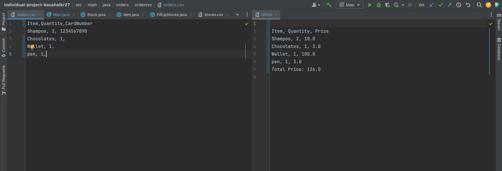
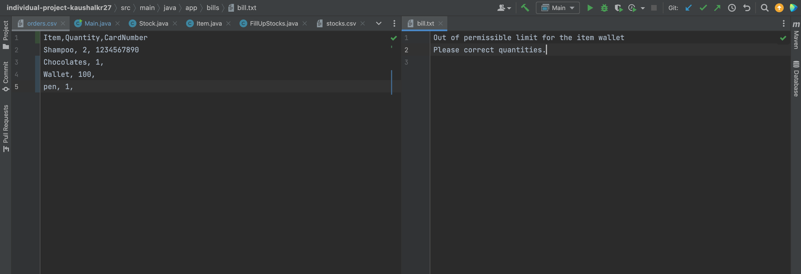

# Individual Project
***
### Name: Kaushal Karinaga Shetter Raju
### Student ID: 015721238
***
## Files:
#### 1. Output file: ```src/main/java/app/bills/bill.txt```
#### 2. Input file(order): ```src/main/java/orders/ordercsv/orders.csv```
#### 3. Inverntory stock: ```src/main/java/inventory/stockdb/stocks.csv```
#### 4. Card Deatils: ```src/main/java/app/bills/cardDetails.csv```
***
## Instructions to run the project:
#### 1. Open terminal window in your system (Mac/Windows/Linux).
#### 2. Type ```git clone https://github.com/gopinathsjsu/individual-project-kaushalkr27.git``` in the terminal window.
#### 3. Navigate into the root of the project directory by running ```cd individual-project-kaushalkr27```
#### 4. First run ```mvn compile``` and then ```mvn exec:java -Dexec.mainClass=app.Main```
#### 5. You will see the output in the bill.txt in ```./src/main/java/app/bills/bill.txt```
***
## Class Diagram:

***
## Design Patterns Used:
#### 1. Factorization
#### 2. Factory Design
***
## Screenshots:
#### 1. Running the project


#### 2. Sample Input and Output


#### 3. Sample Input and Output with Edge Case


